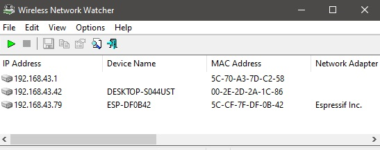
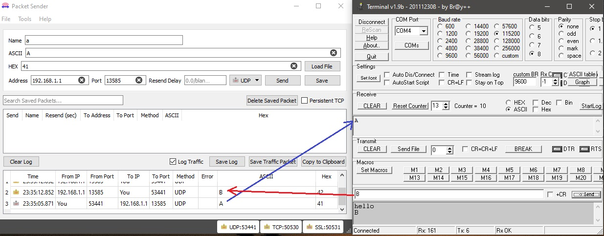
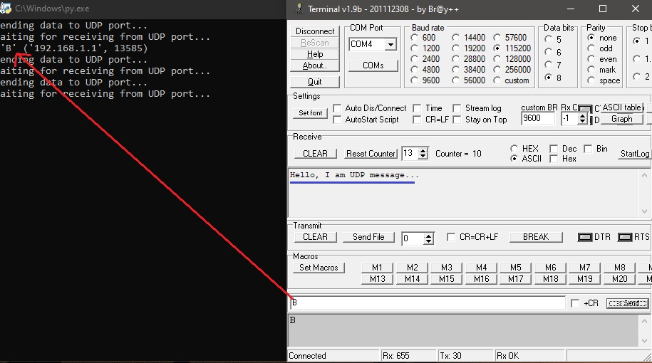
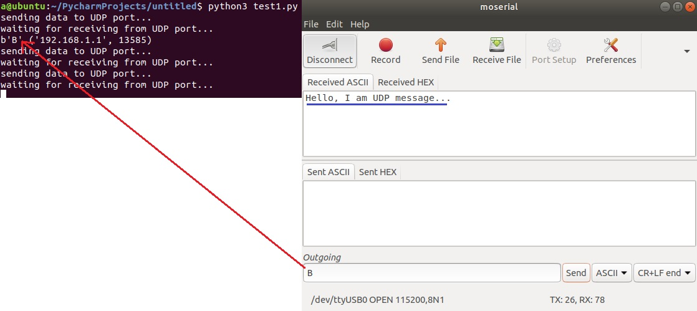
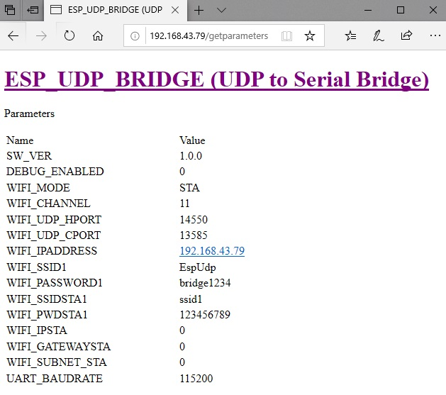
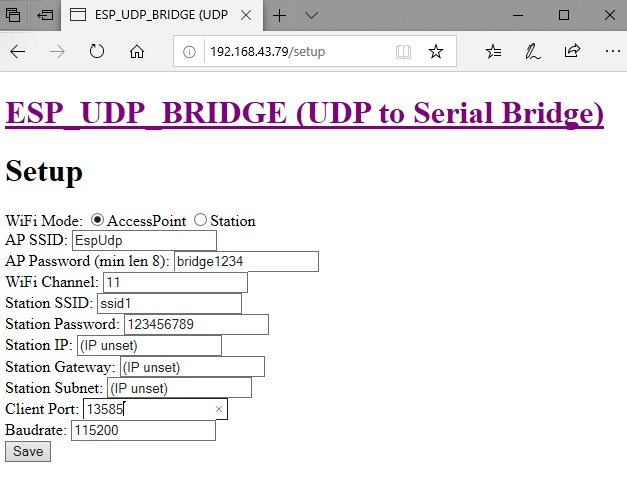
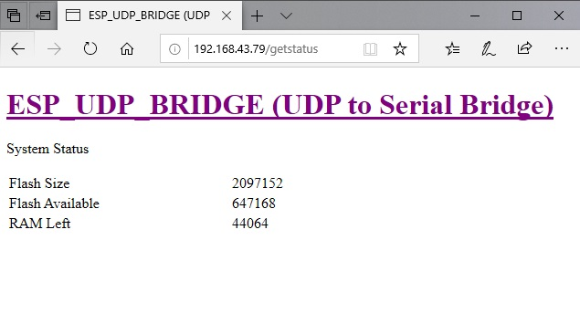

# Welcome to ESP_UDP_Bridge

*Author:* Masoud Iranmehr

*Email:* [masoud.iranmehr@gmail.com](mailto:masoud.iranmehr@gmail.com)

*Github Page:* [github.com/masoud-iranmehr/ESP_UDP_Bridge](https://github.com/masoud-iranmehr/ESP_UDP_Bridge)

# Introduction
This is a C++ code based on Arduino for using on ESP8266 modules. This code creates a configurable bridge between Serial port and UDP sockets. You can use this project and compile it for your ESP module and benefit from a bidirectional link between your UDP application (such as python or ...) and ESP Serial port. You can use this bridge in "Access point (AP)" mode or "Client (STA)" mode. In AP mode, you can connect your computer directy to your ESP module. And in "STA" mode, you have to connect both your computer and your ESP module to a WiFi router (Station) in order to use this bridge. Also this code includes a WebServer in which it provides you a simple HTML web page in order to config the parameters.

# How to use (For Windows Users)

## Install requirements

### Install Arduino
Just install Arduino and ESP8266 package according to this [link](https://www.electronicshub.org/esp8266-arduino-interface/).

### Install "Packet Sender" or "Python"
Packet Sender is a simple wndows software for send and receive TCP/UDP packets. You can use this software to test this project. You can download this software via this [link](https://packetsender.com/download). Also a python code is included in this project to test the project. If you want to test with python, you have to install python for windows via this [link](https://www.python.org/downloads/windows/).

### Install "Network Watcher" (Not needed for "AP" mode)
Network Watcher is a hany software tool for finding local IP addresses related to devices connected to the router. This software would help you to find the ocal IP adres of ESP module while in "STA" mode, because in this mode, ESP is connected to your router device and you have to get its local IP address. You can download this software via this [link](https://wireless-network-watcher.en.softonic.com/).
In order to find ESP local IP address, you have to click on "start" button and then copy the IP from the list which have "Espressif Inc." Network Adapter:

## Connect to your ESP access point
At first point, you have to use this code on AP mode to configure your ESP. In order to do this, you have to flash ESP via Arduino and then you would see a new router named "EspUdp". You can connect to this using "bridge1234" as password (This is a default password and you can change that in future).
After that you can open a web browser on "192.168.1.1" and see ESP setup tools for configuring parameters. By default, you this bridge uses this parameter values:

    UDP port = 13585
    Serial Buadrate = 115200

## Testing the bridge with "Packet Sender" software
At first you need a serial terminal program in order to send and receive serial messages for using your ESP module. Then you can set the address to "192.168.1.1" and port "13585" and set the packet type as UDP. Then type your data and then send it. You would see those characters on your serial port. Then if you send some characters from serial monitor software, you will see them in "Packet Sender" software. 

## Testing the bridge with Python code
At first you need a serial terminal program in order to send and receive serial messages for using your ESP module. Then if you run the "test1.py" you will see that your serial monitor software shows "Hello, I am UDP message..." characters send from your computer to your ESP module. Then if you send some characters from serial monitor software, you will see them in python console.

# How to use (For Linux-debian Users)

## Install requirements

### Install Arduino
Just install Arduino and ESP8266 package according to this [link](https://www.electronicshub.org/esp8266-arduino-interface/).

### Install Python
Just follow this command for installing python3:

* `sudo apt-get install python3.8` - Installs python3.

### Install arp-scan (Not needed for "AP" mode)
If you are using Linux, just follow this command for installing python3:

* `sudo apt-get install arp-scan` - Installs arp-scan software for monitoring IP addresses connected to the router and find the ESP module when you are using it in "STA" mode.

### Install moserial (Serial Monitor software for linux)
Just follow this command for installing moserial:

* `sudo apt-get install moserial` - Installs moserial

Then for running this software, you can use this command:

* `sudo moserial`

## Connect to your ESP access point
At first point, you have to use this code on AP mode to configure your ESP. In order to do this, you have to flash ESP via Arduino and then you would see a new router named "EspUdp". You can connect to this using "bridge1234" as password (This is a default password and you can change that in future).
After that you can open a web browser on "192.168.1.1" and see ESP setup tools for configuring parameters. By default, you this bridge uses this parameter values:

    UDP port = 13585
    Serial Buadrate = 115200

## Testing the bridge
At first you need "moserial" software in order to send and receive serial messages for using your ESP module. Then connect to the serial port and use 115200 as baudrate (By default /dev/ttyUSB0 may be chosen as serial port in linux). Then if you run the "test1.py" via the below command, you will see that your serial monitor software shows "Hello, I am UDP message..." characters send from your computer to your ESP module. Then if you send some characters from serial monitor software, you will see them in python console.

* `python3 python_test/test1.py` - Runs the python code included in this project

# Configure parameters
Total parameters with their descriptions are listed below:

* `WiFi Mode` - Determines the mode "STA" (Station) or "AP" (Access Point)

* `AP SSID` - Access Point SSID for your ESP (this parameter will be used if your ESP is in "AP" mode)

* `AP Password` - Access Point SSID for your ESP (this parameter will be used if your ESP is in "AP" mode)

* `WiFi Channel` - WiFi channel

* `Station SSID` - SSID name of your router (this parameter will be used if your ESP is in "STA" mode)

* `Station Password` - Password of your router (this parameter will be used if your ESP is in "STA" mode)

* `Station IP` - Local IP address of your IP (this parameter will be used if your ESP is in "STA" mode)

* `Station Gateway` - Gateway address of your IP (this parameter will be used if your ESP is in "STA" mode)

* `Station Subnet` - Subnetwork address of your IP (this parameter will be used if your ESP is in "STA" mode)

* `Client Port` - Bridge UDP port

* `Baudrate` - Serial baudrate

## Root page
The default local IP address of ESP in this project in "AP" mode is "192.168.1.1", but if your ESP is in "STA" mode, you have to find its IP with mentioned softwares. For accessing to root page, just type this address on your browser (Suppose that if your ESP IP address is "192.168.43.79" while in "STA" mode):

    192.168.43.79

## Get parameters

Just type this address on your browser (Suppose that ESP IP address is "192.168.43.79"):

    192.168.43.79/getparameters

## Set parameters
Just type this address on your browser (Suppose that ESP IP address is "192.168.43.79"):

    192.168.43.79/setup

Remember that you have to click "save" button in order to save all parameters in EEPROM memory inside ESP module. Also if you want to take effect of the changes, you need to reboot your ESP, this can be done via browser "YOUR_ESP_IP/reboot" or simply reset your ESP module hardware.

## Get status
Just type this address on your browser (Suppose that ESP IP address is "192.168.43.79"):

    192.168.43.79/getstatus

## Reboot page
Just type this address on your browser (Suppose that ESP IP address is "192.168.43.79"):

    192.168.43.79/reboot

